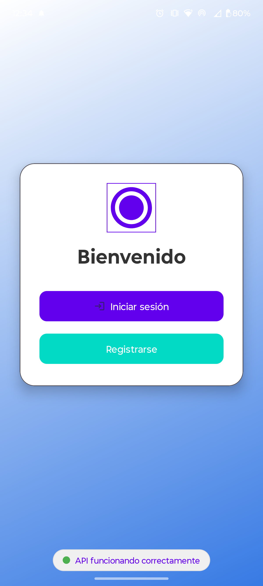
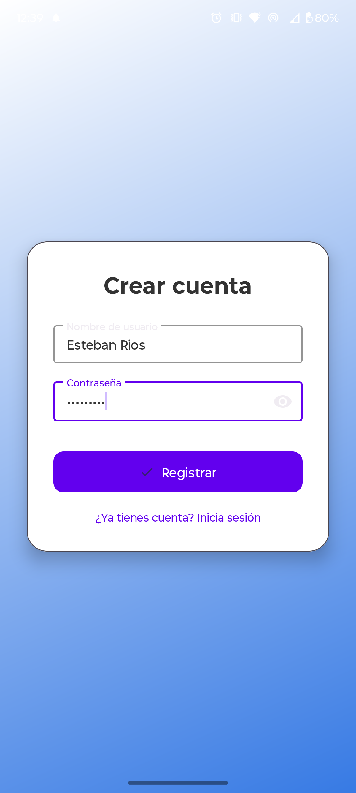
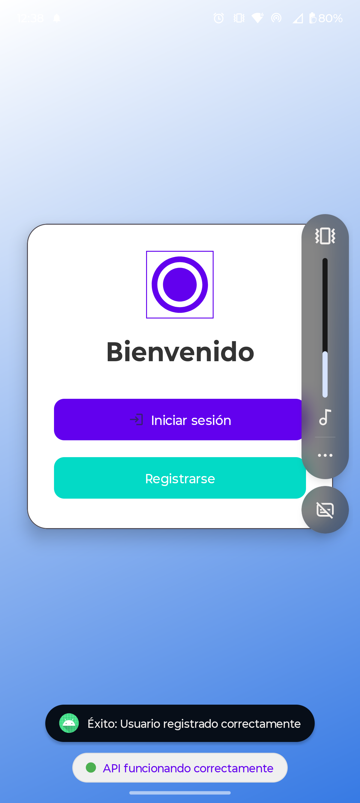
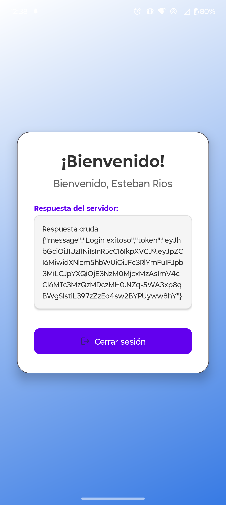
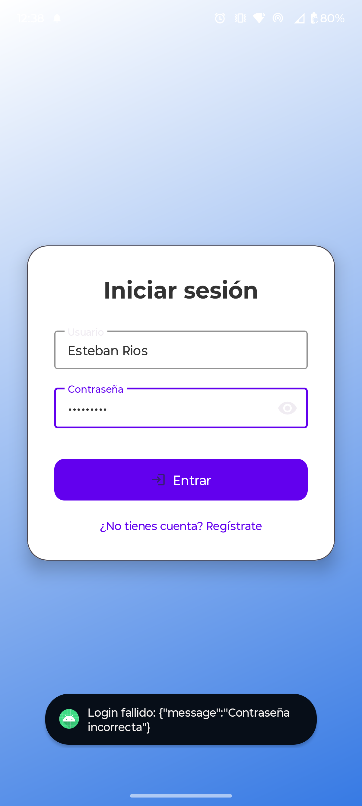
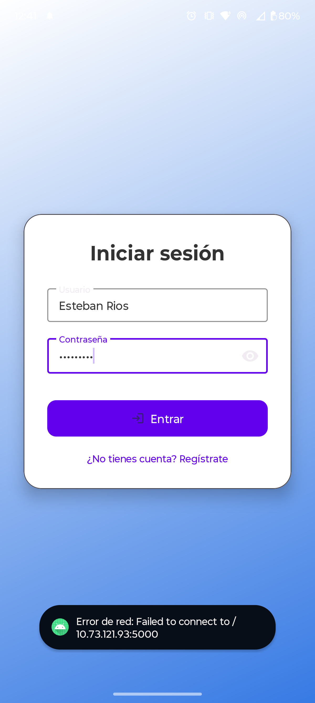

# Tarea 3 - Backend de la Práctica 2

Este proyecto es una aplicación Android nativa desarrollada en Kotlin que se conecta a un backend dockerizado (API REST) expuesto en el puerto 5000. La app permite registro de usuarios, inicio de sesión con JWT, y muestra mensajes de la API. Está diseñada para ejecutarse en un dispositivo físico en la misma red Wi‑Fi que el servidor.

## Requisitos previos

- Android Studio (versión recomendada: Giraffe o superior)
- JDK 11 o superior
- Backend dockerizado corriendo en tu PC (puerto 5000)
- Dispositivo Android físico con depuración USB activada (o emulador, pero se recomienda físico)
- Misma red Wi‑Fi para el PC y el dispositivo móvil

## Levantar el backend con Docker

1. **Clona o sitúate en la carpeta del backend** que contiene el archivo `docker-compose.yml` y el `Dockerfile`.
2. **Ejecuta el siguiente comando** para construir y levantar los contenedores en segundo plano:
   ```bash
   docker compose up -d
   ```
   > La opción `-d` ejecuta los contenedores en segundo plano.
3. **Verifica que el backend esté corriendo** accediendo desde tu navegador a `http://localhost:5000/`. Deberías ver el mensaje de bienvenida de la API.
4. **Para detener el backend**, usa:
   ```bash
   docker compose down
   ```

## Configuración inicial

1. **Clona el repositorio** en tu máquina local.
2. **Obtén la dirección IP local de tu PC**:
   - En Windows: `ipconfig` (busca la IPv4 de tu adaptador Wi‑Fi).
   - En Linux/macOS: `ifconfig` o `ip addr`.
3. **Configura la URL base** en el código:
   - Abre el archivo `app/src/main/java/com/example/conexionabackend/network/RetrofitClient.kt`
   - Modifica la constante `BASE_URL` con la IP de tu PC, por ejemplo:
     ```kotlin
     private const val BASE_URL = "http://192.168.1.10:5000/"
4. **Verifica la conectividad**: Desde el navegador de tu móvil, accede a `http://<IP-DE-TU-PC>:5000/`. Deberías ver el mensaje de bienvenida de la API.

## Compilación y ejecución

1. Abre el proyecto en Android Studio.
2. Conecta tu dispositivo móvil por USB y activa la depuración USB.
3. Asegúrate de que el backend esté corriendo (ejecuta `docker compose up` en la carpeta del backend).
4. Haz clic en **Run** (triángulo verde) o usa `Shift + F10`.
5. La aplicación se instalará y ejecutará en tu dispositivo.

> **Nota**: Si usas emulador, cambia la URL base a `http://10.0.2.2:5000` (IP especial del emulador).

## Capturas de pantalla

A continuación se muestran las capturas que evidencian el cumplimiento de los ejercicios.

### Ejercicio 1 – Conexión y verificación de la API
Al iniciar la app, se realiza una petición GET al endpoint raíz (`/`) y se muestra el mensaje de respuesta en un `TextView`.



### Ejercicio 2 – Pantalla de Registro
- **Caso exitoso**: registro de un nuevo usuario.





### Ejercicio 3 – Pantalla de Login
- **Login exitoso**: tras credenciales correctas, se navega a la pantalla de bienvenida mostrando el nombre de usuario.
- **Login fallido**: se muestra un mensaje de error (por ejemplo, credenciales inválidas).

| Login exitoso → Bienvenida | Login fallido |
|----------------------------|---------------|
|  |  |

### Ejercicio 4 – Manejo de errores de red
Al detener el backend (`docker compose down`) e intentar hacer login, la app captura la excepción y muestra un mensaje amigable al usuario.



## Funcionalidades adicionales (JWT)

La aplicación implementa autenticación mediante **JWT**:
- Al hacer login exitoso, el token es almacenado localmente con `SharedPreferences` (a través de `TokenManager`).
- En la pantalla de bienvenida se muestra la respuesta cruda del servidor (JSON con el token y posible mensaje).
- Al cerrar sesión, el token se elimina y se regresa a la pantalla principal.

